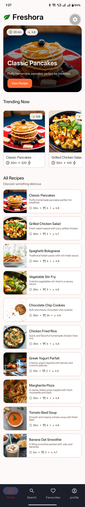
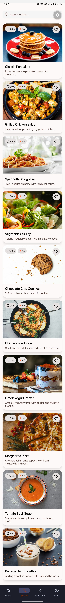
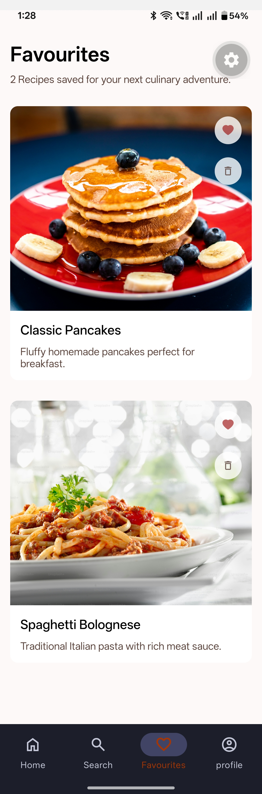
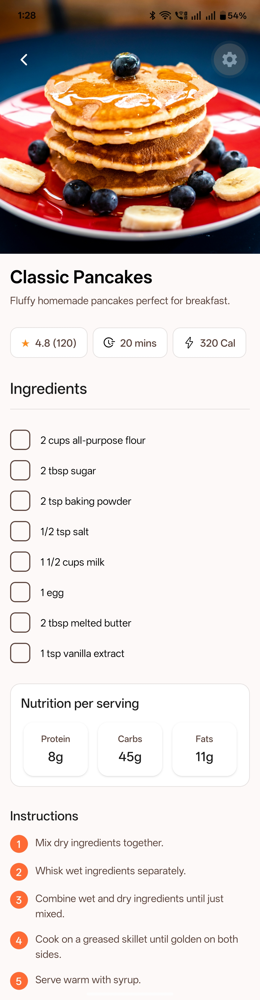

# Freshora

A full-stack recipe discovery and management application built with React Native, Expo, and Express.js. Freshora enables users to browse recipes, save favorites, and manage their culinary preferences with a seamless cross-platform experience.

## Project Overview

Freshora is a modern mobile-first application that combines a responsive React Native frontend with a robust backend API. Users can discover recipes, search by ingredients or cuisine, save favorites, and access detailed nutritional information.

### Key Features

- **Recipe Discovery**: Browse and search an extensive recipe database
- **Favorites Management**: Save and organize favorite recipes
- **Nutritional Information**: View detailed nutrition facts including calories, protein, carbs, and fats
- **User Authentication**: Secure SSO (Single Sign-On) via Clerk
- **Search Functionality**: Filter recipes by name, cuisine, and preferences
- **User Profiles**: Personalized profile management
- **Cross-Platform**: Native iOS and Android support via Expo

## Screenshots

<table align="center">
  <tr>
    <td align="center">
      
    </td>
    <td align="center">
      
    </td>
  </tr>
  <tr>
    <td align="center">
      
    </td>
    <td align="center">
      
    </td>
  </tr>
</table>

## Technology Stack

### Frontend
- **Framework**: React Native with Expo
- **Routing**: Expo Router
- **Styling**: NativeWind (Tailwind CSS for React Native)
- **Authentication**: Clerk Expo SDK
- **Language**: TypeScript

### Backend
- **Runtime**: Node.js
- **Framework**: Express.js
- **Database**: PostgreSQL (Neon Serverless)
- **ORM**: Drizzle ORM
- **Language**: TypeScript

## Project Structure

```
clerk-expo/
├── frontend/                 # React Native/Expo application
│   ├── src/
│   │   ├── app/            # Route handlers and layouts
│   │   ├── components/     # Reusable UI components
│   │   ├── hooks/          # Custom React hooks
│   │   ├── services/       # API integration
│   │   ├── types/          # TypeScript type definitions
│   │   └── utils/          # Utility functions
│   ├── assets/             # Images and other assets
│   └── package.json
│
└── backend/                # Express.js API server
    ├── src/
    │   ├── server.ts       # Main server entry point
    │   └── db/             # Database configuration and schema
    ├── drizzle/            # Database migrations
    ├── scripts/            # Seed and utility scripts
    └── package.json
```

## Prerequisites

- Node.js (v18 or higher)
- npm or yarn
- PostgreSQL database (or Neon serverless account)
- Clerk account for authentication

## Installation

### Backend Setup

1. Navigate to the backend directory:
   ```bash
   cd backend
   ```

2. Install dependencies:
   ```bash
   npm install
   ```

3. Create a `.env` file with the following variables:
   ```
   DATABASE_URL=your_postgresql_connection_string
   ```

4. Push database schema:
   ```bash
   npm run db:push
   ```

5. (Optional) Seed the database with sample recipes:
   ```bash
   npm run db:seed
   ```

6. Start the development server:
   ```bash
   npm run server
   ```

The backend will run on the configured port (default: 3000).

### Frontend Setup

1. Navigate to the frontend directory:
   ```bash
   cd frontend
   ```

2. Install dependencies:
   ```bash
   npm install
   ```

3. Create an `.env.local` file with your Clerk credentials:
   ```
   EXPO_PUBLIC_CLERK_PUBLISHABLE_KEY=your_clerk_key
   EXPO_PUBLIC_API_URL=http://your_backend_url
   ```

4. Start the development server:
   ```bash
   npm start
   ```

   For specific platforms:
   - iOS: Press `i`
   - Android: Press `a`
   - Web: Press `w`

## Available Scripts

### Backend
- `npm run server` - Start development server with hot reload (nodemon)
- `npm run db:push` - Push database schema changes
- `npm run db:seed` - Seed database with sample data

### Frontend
- `npm start` - Start Expo dev server
- `npm run android` - Build and run on Android
- `npm run ios` - Build and run on iOS
- `npm run web` - Run on web

## Database Schema

### Recipes Table
Stores recipe information including:
- Recipe name and description
- Ingredients and instructions
- Preparation time and servings
- Nutritional information (calories, protein, carbs, fats)
- Rating and thumbnail image

### Favourites Table
Stores user-specific favorite recipes:
- User ID (linked to Clerk authentication)
- Recipe reference
- Recipe metadata cache (title, image, cook time, servings)
- Creation timestamp

## API Endpoints

The backend provides RESTful API endpoints for:
- Retrieving recipes
- Searching recipes
- Managing user favorites
- User profile management

Refer to backend documentation for detailed endpoint specifications.

## Authentication

Freshora uses Clerk for secure authentication. The app supports:
- Social sign-on (Google, GitHub, etc.)
- Email/password authentication
- Session management
- Secure token storage via Expo Secure Store

## Development

### Code Style
- TypeScript for type safety
- ESLint for code linting
- Consistent formatting across both frontend and backend

### Contributing
1. Create a feature branch
2. Make your changes
3. Run linting and tests
4. Submit a pull request

## Performance Considerations

- Lazy loading of recipe lists
- Image optimization for mobile
- Efficient database queries with Drizzle ORM
- Caching strategies for frequently accessed data

## Troubleshooting

### Database Connection Issues
- Verify your `DATABASE_URL` is correct
- Ensure your PostgreSQL instance is accessible
- Check firewall and security group settings

### Authentication Issues
- Confirm Clerk credentials are correctly set
- Check that redirect URLs are configured in Clerk dashboard
- Verify environment variables are loaded

### Build Issues
- Clear node_modules and reinstall: `rm -rf node_modules && npm install`
- Clear Expo cache: `expo start --clear`
- Ensure Node.js version compatibility

## Future Enhancements

- Advanced filtering and recommendation algorithms
- Meal planning and shopping list features
- Social sharing of recipes
- Offline recipe access
- Recipe ratings and reviews

## License

ISC

## Contact

Author: Askhit

---

For more information, please refer to individual README files in the frontend and backend directories.
